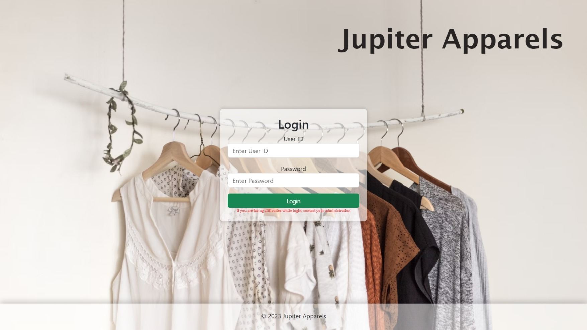
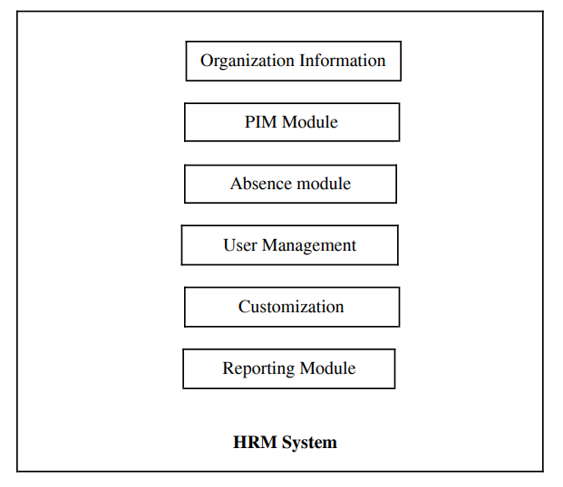
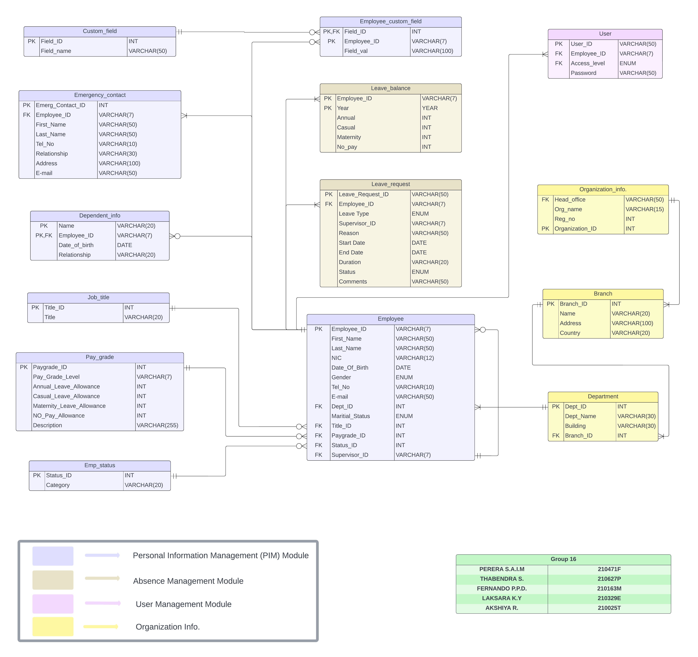
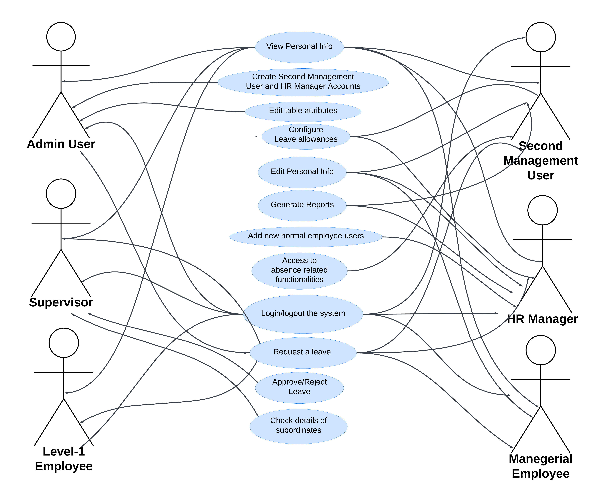
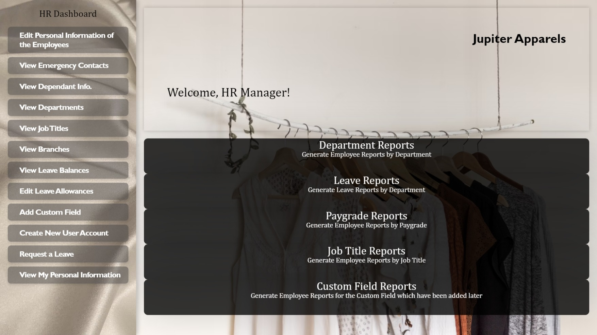

# Human Resource Management System

 


## Overview

This project is a Human Resource Management System (HRMS) designed for Jupiter Apparels, a multinational apparel company. The system is designed to manage the company's human resources, including these key features:

- Login/ Logout
- Creating new employee profiles
- Viewing employee profiles
- Updating employee profiles
- Leave Requesting
- Leave Approval/ Rejection
- Report Generation
- Customizing Leave Allowances
- Changing Table Attributes
- and other non-functional requirements

The major components of the overall system can be represented as follows:   



## Database Structure

The database structure of the HRMS is designed to store information about employees, departments, job positions, leave requests, and much more. The database schema is designed to be flexible and scalable, allowing for easy customization and integration with other systems. The database schema is represented as follows:



The relationship between the system and stakeholders can be reflected through the following use case diagram:




## Getting Started

#### Prerequisites
Before you begin, ensure you have the following software installed on your machine:
- Node.js (version 14.x or higher)
- npm (version 6.x or higher)
- MySQL (version 5.7 or higher)

#### 1. Clone the repository

Clone the project repository from GitHub:
```
git clone https://github.com/Irash-Perera/Database-Project---HR-Management-System.git
```
#### 2. Restore the database

To restore the database from the provided `.sql` file:

1. Open MySQL Workbench or any other MySQL client.
2. Copy the sript from `jupiterapparels_Grp 16.sql` and run it in the MySQL client.

Now you can see a new database named `jupiterapparels` which has already been populated with sample data.

#### 3. Set up the backend

Navigate to the backend folder and install the necessary npm modules:

```
cd backend
npm install
```
Create a `.env` file in the backend folder and add the following environment variables:

```
DB_HOST=localhost
DB_USER=your_mysql_username
DB_PASSWORD=your_mysql_password
DB_NAME=hrms
PORT=5000
```
Replace `your_mysql_username` and `your_mysql_password` with your MySQL credentials.

Start the backend server:

```
npm start
```
#### 4. Set up the frontend
Navigate to the client folder and install the necessary npm modules:

```
cd ../client
npm install
```
Start the frontend server:

```
npm start
```

#### 5. Access the application
Open your browser and navigate to
```
http://localhost:3000/
```
Replace `3000` with the port number you specified in the `.env` file.

Refer the `Password.txt` file for the login credentials.

Try login with different roles and explore the system👽🔥.

Screenshot from HR Manager's dashboard:


## Additional Information
The system employs various stored procedures, functions, and triggers to ensure ACID properties and maintain data integrity. Foreign keys and primary keys are set appropriately to maintain consistency. Indexing has been applied to improve query performance where necessary.

Refer `HRM_System_Group16.pdf` and `Project Description 2` for more information.

