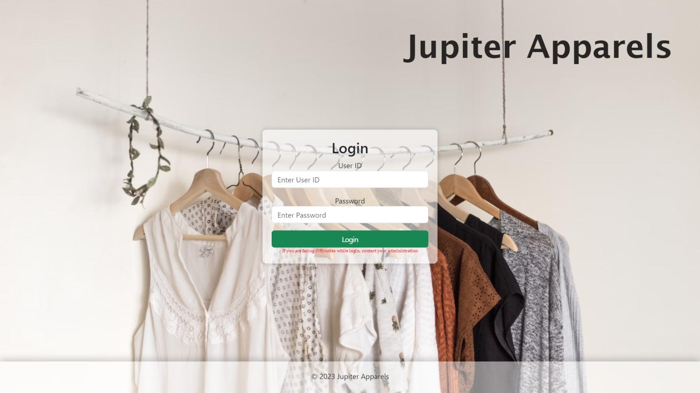
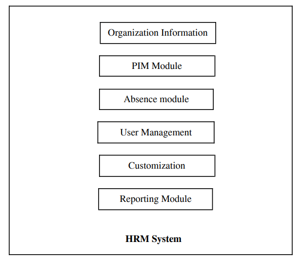
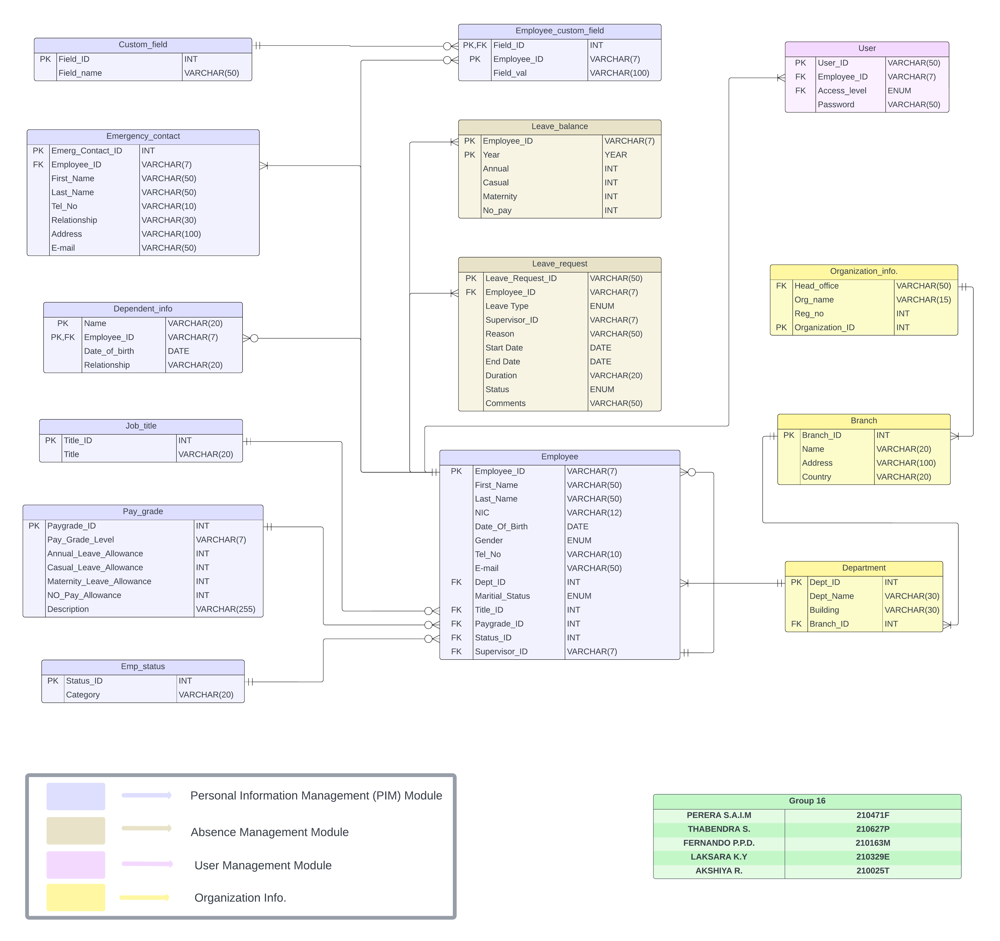
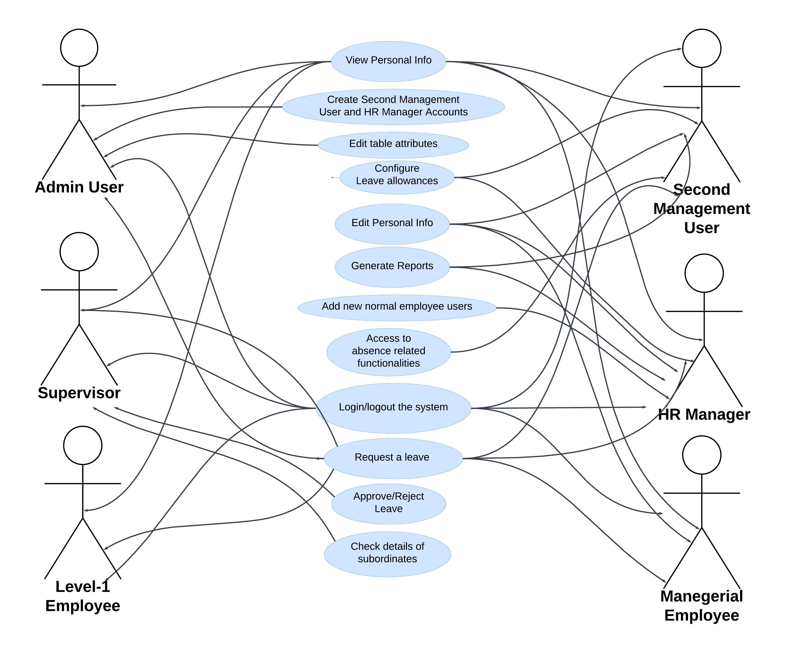
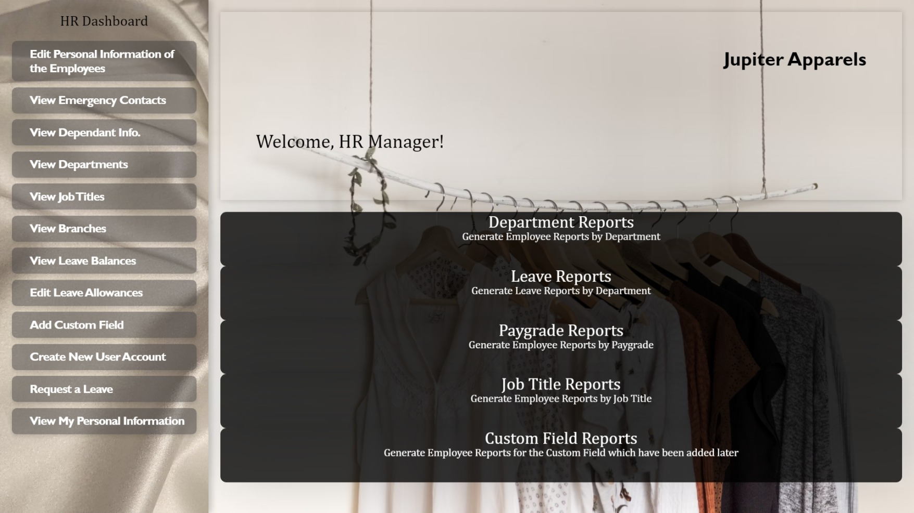

# Human Resource Management System

 


## Overview

This project is a Human Resource Management System (HRMS) designed for Jupiter Apparels, a multinational apparel company. The system is designed to manage the company's human resources, including these key features:

- Login/ Logout
- Creating new employee profiles
- Viewing employee profiles
- Updating employee profiles
- Leave Requesting
- Leave Approval/ Rejection
- Report Generation
- Customizing Leave Allowances
- Changing Table Attributes
- and other non-functional requirements

The major components of the overall system can be represented as follows:   



## Database Structure

The database structure of the HRMS is designed to store information about employees, departments, job positions, leave requests, and much more. The database schema is designed to be flexible and scalable, allowing for easy customization and integration with other systems. The database schema is represented as follows:



The relationship between the system and stakeholders can be reflected through the following use case diagram:




## Getting Started

#### Prerequisites
Before you begin, ensure you have the following software installed on your machine:
- Node.js (version 14.x or higher)
- npm (version 6.x or higher)
- MySQL (version 5.7 or higher)

#### 1. Clone the repository

Clone the project repository from GitHub:
```
git clone https://github.com/Irash-Perera/Database-Project---HR-Management-System.git
```
#### 2. Restore the database

To restore the database from the provided `.sql` file:

1. Open MySQL Workbench or any other MySQL client.
2. Copy the sript from `jupiterapparels_Grp 16.sql` and run it in the MySQL client.

Now you can see a new database named `jupiterapparels` which has already been populated with sample data.

#### 3. Set up the backend

Navigate to the backend folder and install the necessary npm modules:

```
cd backend
npm install
```
Create a `.env` file in the backend folder and add the following environment variables:

```
DB_HOST=localhost
DB_USER=your_mysql_username
DB_PASSWORD=your_mysql_password
DB_NAME=hrms
PORT=5000
```
Replace `your_mysql_username` and `your_mysql_password` with your MySQL credentials.

Start the backend server:

```
npm start
```
#### 4. Set up the frontend
Navigate to the client folder and install the necessary npm modules:

```
cd ../client
npm install
```
Start the frontend server:

```
npm start
```

#### 5. Access the application
Open your browser and navigate to
```
http://localhost:3000/
```
Replace `3000` with the port number you specified in the `.env` file.

Refer the `Passwords.txt` file for the login credentials.

Try login with different roles and explore the system👽🔥.

Screenshot from HR Manager's dashboard:


## Additional Information
The system employs various stored procedures, functions, and triggers to ensure ACID properties and maintain data integrity. Foreign keys and primary keys are set appropriately to maintain consistency. Indexing has been applied to improve query performance where necessary.

Refer `HRM_System_Group16.pdf` and `Project Description 2` for more information.

## Docker Deployment

This repository now includes Docker support for the full stack:

- `client/Dockerfile` builds the React UI and serves it with Nginx.
- `backend/Dockerfile` builds the API server.
- `docker-compose.yml` starts MySQL, backend, and client together.
- `docker-compose.prod.yml` overrides restart behavior for production-style runs.
- `.env.example` contains the compose and runtime values you can copy into `.env`.

### Local startup with Docker

1. Copy `.env.example` to `.env` in the repository root.
2. Make sure Docker Desktop is running.
3. Start the stack:

```bash
docker compose up --build
```

4. Open the app in your browser:

```bash
http://localhost:3000
```

### Production-style compose run

Use the production override when you want the same stack with always-on restarts:

```bash
docker compose -f docker-compose.yml -f docker-compose.prod.yml up -d --build
```

### Important notes

- The MySQL schema is loaded from `jupiterapparels_Grp 16.sql` the first time the database volume is created.
- The backend container reaches MySQL through the service name `db`, not `localhost`.
- The React app reaches the backend through the host-published backend port during local development.
- For hosted frontend builds such as Cloudflare Pages, set `REACT_APP_API_URL` to your deployed backend URL before building the client.
- If you need to reload the SQL seed from scratch, remove the Docker volume before starting again.

### CI/CD

A GitHub Actions workflow is included at `.github/workflows/ci.yml` to run backend tests, client tests, the client build, and Docker compose validation/build checks.

The production workflow at `.github/workflows/production.yml` can also publish Docker images to GHCR and deploy the Oracle-hosted database and backend automatically without cloning the repository on the VM.

### Oracle deployment automation

The Oracle deployment workflow uses `docker-compose.oracle.yml` and copies only the deploy bundle to the VM:

- `docker-compose.oracle.yml`
- `Caddyfile`
- `Database/jupiterapparels_Grp 16.sql`
- a generated `.env` file built from GitHub Actions secrets

To enable it, configure these repository secrets:

- `ORACLE_HOST` - your Oracle VM public IP or DNS name
- `ORACLE_USERNAME` - the SSH user on the VM
- `ORACLE_SSH_PRIVATE_KEY` - the private key used by GitHub Actions to SSH into the VM
- `ORACLE_DEPLOY_PATH` - the target folder on the VM, for example `/home/ubuntu/hrms-deploy`
- `ORACLE_MYSQL_ROOT_PASSWORD`
- `ORACLE_MYSQL_DATABASE`
- `ORACLE_MYSQL_PORT`
- `ORACLE_BACKEND_PORT`
- `ORACLE_DB_USER`
- `ORACLE_DB_PASSWORD`
- `ORACLE_DB_NAME`
- `ORACLE_API_DOMAIN` - for example `api.yourdomain.com`
- `ORACLE_ACME_EMAIL` - email for automatic HTTPS certificate issuance
- `ORACLE_CORS_ALLOWED_ORIGINS` - comma-separated frontend origins allowed to call the API
- `GHCR_READ_USERNAME` - a GitHub username that can read the package
- `GHCR_READ_TOKEN` - a GitHub token with `read:packages`

Deployment runs automatically on pushes to `Develop`, on version tags matching `v*`, and on manual workflow dispatch.

For Cloudflare Pages and Oracle to work together over HTTPS:

- create a DNS `A` record for your backend domain such as `api.yourdomain.com` pointing to `158.178.143.114`
- open inbound TCP ports `80` and `443` on the Oracle VM and in Oracle Cloud security rules
- set `REACT_APP_API_URL=https://api.yourdomain.com` in Cloudflare Pages before rebuilding the client
- set `ORACLE_CORS_ALLOWED_ORIGINS` to the exact frontend origins you will serve, such as your `pages.dev` URL and your final custom frontend domain

The Oracle deployment uses Caddy to terminate HTTPS on `api.yourdomain.com` and reverse-proxy traffic to the internal backend container on port `8800`.

